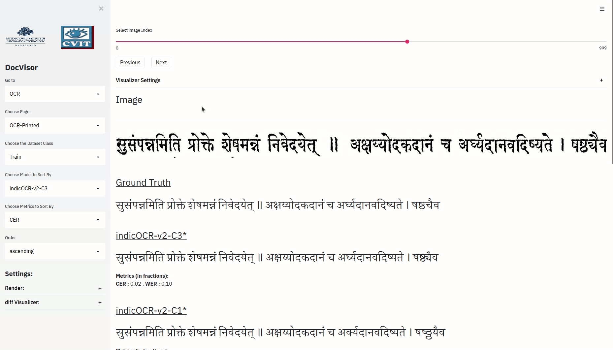
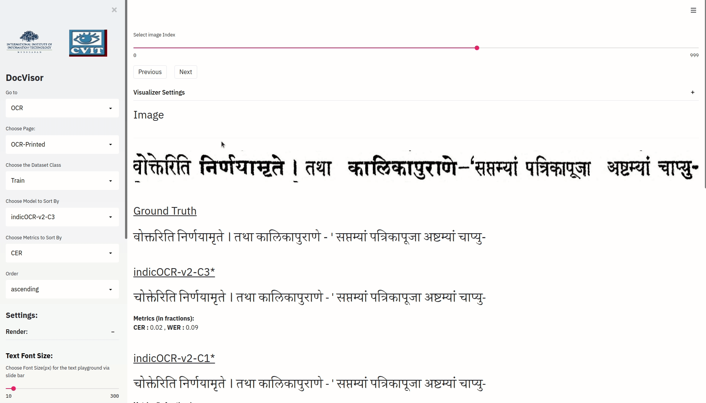
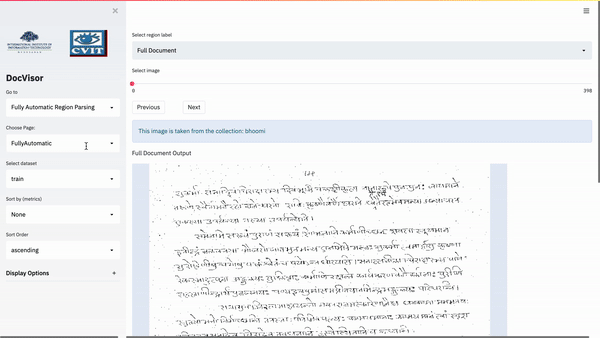
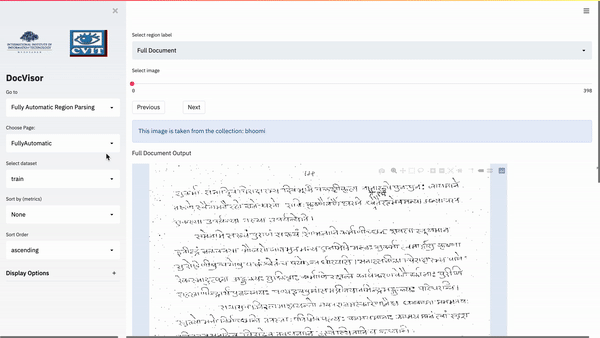
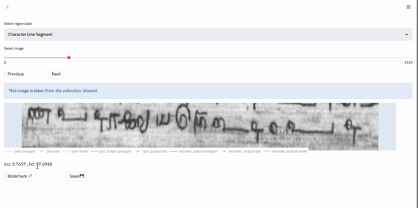

# About DocVisor 

DocVisor is an open-source visualization tool for document layout analysis. With DocVisor, it is possible to visualize data from three prominent document analysis tasks: Full Document Analysis, OCR and Box-Supervised Region Parsing. DocVisor offers various features such as ground-truth and intermediate output visualization, sorting data by key metrics as well as comparison of outputs from various other models simultaneously.

---

<div align="center">
    <a href="https://youtu.be/37CBvyQfPKI">
        
    </a>
<br>
<table>
    <tr>
        <td>
            <a href="https://youtu.be/37CBvyQfPKI" target="_blank">
                
            </a>
        </td>
    </tr>
    <tr>
        <th><samp>Teaser Video (Click on Image above)</samp></th>
    </tr>
</table>
</div>
    
---


# Contents:
- [About DocVisor](#about-docvisor)
- [DocVisor Features](#docvisor-features)
    - [OCR Layout](#ocr-layout)
        - [Text Selection](#text-selection)
        - [Image Selection](#image-selection)
        - [Latex OCR](#latex-ocr)
    - [Fully Automatic Layout](#fully-automatic-layout)
        - [Indiscapes-v2 Dataset](#indiscapes-v2-dataset)
        - [PubTabNet Dataset](#pubtabnet-dataset)
        - [DocBank Dataset](#docbank-dataset)
    - [Box Supervised Layout](#box-supervised-layout)
- [Getting Started](#getting-started)
    - [Step 1: Download DocVisor](#step-1-download-docvisor)
        - [Clone Using Git](#clone-using-git)
        - [Download Zip](#download-zip)
    - [Step 2: Data Preperation](#step-2-data-preperation)
    - [Step 3: Setting up your environment](#step-3-setting-up-your-environment)
    - [Step 4: Modify Config File](#step-4-modify-config-file)
    - [Step 5: Launch the tool](#step-5-aunch-the-tool)
- [Load Example Data](#load-example-data)
- [Full Documentation](#full-documentation)


-----


**NOTE: A detailed documentation to this repository is provided at : https://ihdia.iiit.ac.in/docvisor/** 

-----

# DocVisor Features


DocVisor also supports visualization of some common datasets such as [PubTabNet](https://github.com/ibm-aur-nlp/PubTabNet) and [DocBank](https://github.com/doc-analysis/DocBank).

## OCR Layout

There are two main components of the OCR Layout provided in the docvisor tool:

### Text Selection:
The user can select a substring of the text, and the corresponding portion in the image gets highlighted.

Note: This component will only work if you have attentions for your model.





Gif depicting the Text2Image mapping using the Text Selection feature provided in OCR layout of the DocVisor tool.


## Image Selection: 
The user can select a sub-portion of the image, and the corresponding substring in the predicted text of models having attentions gets highlighted.



Gif depicting the Image2Text mapping using the Image Selection feature provided in OCR layout of the DocVisor tool. 

## Latex OCR: 

The tool also supports data involving latex. The tool displays both the compiled and actual ground truth/ predicted string. This feature is presently only for non-attention models. The user can use this feature by setting the `dtype` variable in the metadata to `latex`.


Gif depicting the Latex support provided by the OCR layout of the docvisor tool.


## Fully Automatic Layout

### Indiscapes-v2 Dataset


Gif showing the visualization of ground Truth and predictions on the Indiscapes-v2 dataset using the Fully Automatic Layout.

### MS-COCO Dataset


Gif showing the visualization of ground Truth and predictions on the MS-COCO dataset using the Fully Automatic Layout.

### PubTabNet Dataset
Our Fully Automatic Layout can also be used to load and visulaize the PubTabNet dataset. A gif of the same is added below:



Gif showing the visualization of ground Truth and predictions on the PubTabNet dataset using the Fully Automatic Layout.


### DocBank Dataset
Our Fully Automatic Layout can also be used to load and visulaize the DocBank dataset. A gif of the same is added below:



Gif showing the visualization of ground Truth and predictions on the DocBank dataset using the Fully Automatic Layout.

## Box Supervised Layout



Gif showing the region wise visualization of ground Truth and predictions on the indiscapes-v2 dataset.


# Getting Started


## Step 1: Download DocVisor

### Clone Using Git

If you have git installed on your local machine, run the following command to clone the docvisor repository.

```
git clone https://github.com/ihdia/docvisor
```

### Download Zip

If you do not have git or you want to download the zip file, download the zip file from [here](https://github.com/ihdia/docvisor/archive/refs/heads/main.zip) and unzip the tool to any location on your divice.

## Step 2: Data Preperation

There three main layouts of the DocVisor tool:

1. Fully Automatic
2. Box Supervised
3. OCR

You can load one or more of these tools to the DocVisor tool at any given point in time.

- To load the Fully Automatic tool, prepare your datafiles as described [here](https://ihdia.iiit.ac.in/docvisor/fa_setup.html)
- To load the Box Supervised tool, prepare your datafiles as described [here](https://ihdia.iiit.ac.in/docvisor/box_setup.html)
- To load the OCR tool, prepare your datafiles as described [here](https://ihdia.iiit.ac.in/docvisor/ocr_layout.html) 


## Step 3: Setting up your environment

1. Create a conda environment using the following command:

    ```
    conda create --name docvisor python=3.7
    ```
2. Ensure that the pip points to the docvisor environment by running `which pip`. If it does not, then run the following command:

    ```
    conda install pip
    ```
3. Install the requirements necessary:

   ```
   pip install -r requirements.txt
   ```


## Step 4: Modify Config File

1. Place all the metaData files in one directory

The metaData directory will look like:

    metaData/
        - ocr_handwritten.json
        - ocr_printed.json
        - fullyAutomatic.json
        - boxSupervised.json


2. Change the path of the metaData file in the docvisor/config.py file.


## Step 5: Launch the tool

Launch the tool by running `./run.sh` script. 

# Load Example Data
 
 We have provided an example folder in the repository for all the layouts. To load the example layouts, follow the steps below:

1. Ensure that the `metaDataDir` field in `tool/config.py` is set to `example/metaData`
2. Run `./run.sh` script to load the app

**NOTE:** Ensure that the requirements have been installed. To do so, refer to [this step](#step-3-setting-up-your-environment).

# Full Documentation

For a detailed documentation of each tool, kindly visit the [DocVisor's documentation page](https://ihdia.iiit.ac.in/docvisor/).


