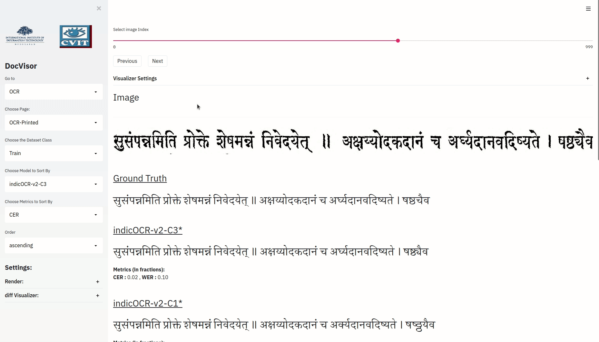

## Overview

This site provides all documentation that is needed for setting up, configuring and running the DocVisor tool. The tool contains layouts for common document analysis tasks: OCR, Weakly Supervised Region Segmentation and Fully Automatic Region Segmentation. The tool is designed such that the user only needs to provide their data and set up the configuration files for loading the tool. 

The instructions provided in the document should be sufficient to help you set up the tool. In case you face any issues, you can feel free to contact any of the [Contributors](/icdar-visualizer/contributors.html).

## Page-Layouts

### OCR

The OCR task involves recognizing text from images. Our tool is particularly designed to interact with and visualize the outputs of models which are trained using the attention mechanism. 

In particular, the OCR layout is meant to visualize the results of OCR models trained for **line images** using the attention mechanism. While the layout is best experienced if the user provides the data with attentions, the layouts can be loaded even with simple images and prediction/ground truth data wand does not require the user to have attentions for it to load. 

In compliance with the design of the whole tool, the OCR layout is extremely easy to use, and has loads of features that help the user focus on their analysis of the trained models.

There are two main features of the OCR layout:

#### Text Selection:

Text Selection is a feature that allows the user to select any substring of the predicted text and see its corresponding portion highlighted in the image.

The following gif should give a good idea of the feature.

Note: This feature requires that the attention matrix is provided as an input by the user. For more details check the OCR layout page.

#### Image Selection:

The Image Selection is a feature that allows the user to select any portion of the line image and have the corresponding predicted text highlighted.

The following gif should give a good idea of the Image Selection Feature:

The layout is designed to be highly customizable. All the relevant settings can be adjusted via the setting panel in the left side panel of the OCR layout. For more details about getting started with the OCR tool, visit **add reference**.

### Fully-Automatic Layout:

Those region segmentation approaches which do not have supervision during inference come under the family of fully-automatic region segmentation. Here, the model identifies the various regions, along with their corresponding labels.

DocVisor provides the utility of output visualization of the model by being able to simultaneously view the ground truth and model output for every region, as well as the entire document. Additionally, the user can also visualize outputs on a full-document basis.

The following gif shows the output selection and visualization process:

The user can click once on the output to be visualized, and it is then overlayed on the existing plot. This way, visualized outputs can be stacked on another for a better visual comparison. The user can also double-click on a single output to isolate it, i.e. only that output is visualized.

In the full-document output, the current region being shown above is highlighted in red, so that the user knows where the reigon is with respect to the document as a whole.

### Box-Supervised Layout:

This layout is primarily useful for those tasks which involve weakly-supervised region segmentation with the help of bounding boxes. Specifically, the tool enables the user to view the various possible outputs within the pipeline of the model on a per-region basis. 

For a single region, the app renders a plot with only the current region of interest shown. The user can select the outputs they wish to visualize and so the different outputs can be compared.

The following gif shows the output selection and visualization process:

We can see that the visualization process is the same as in the fully-automatic layout.


